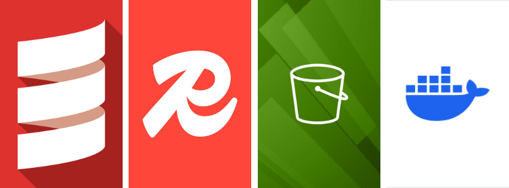
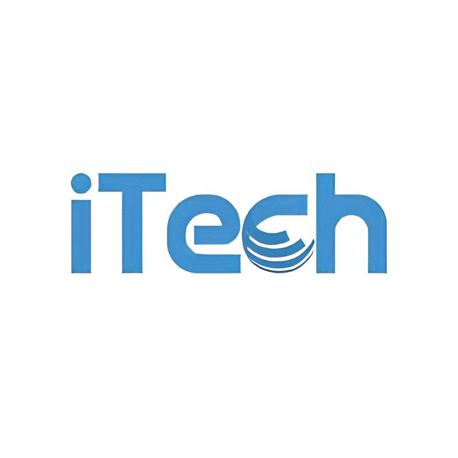
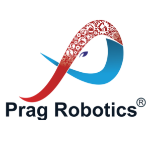

## About me

Hi, I'm Sharan K. I kicked off my programming journey with **C++** in 11th grade, and let’s just say it wasn’t exactly smooth sailing—more like a roller coaster ride through a maze of confusion. I struggled, questioned all my life choices, and then stumbled into **C**, thinking it might be a bit more forgiving. But then, **Python** swooped in like a superhero in a cape and made everything click! I dove into basic AI, and suddenly, coding felt more like a fun puzzle than a never-ending headache. After surviving C and Python, I thought I was ready to take on the world… until **Java** showed up, like that one relative who insists on showing up uninvited. But then I realized **Java** and **Scala** are basically twins—same family, just one with a slightly cooler vibe. Scala’s modern flair won me over, and I’ve been happily exploring it ever since. Over time, though, I realized that **C++** had secretly been strengthening my programming muscles all along, so I still follow it religiously. Now I'm leveling up my DSA skills on LeetCode—because who needs sleep anyway?

## Skills

- **Programming Languages**: Scala 🧑‍💻, Python 🐍, C++ 💻
- **Web Development**: API Development 🌐, RESTful Services 🔗, Microservices Architecture 🏗️
- **Databases**: Redis 🔴, PostgreSQL 🐘, DynamoDB ⚡, S3 (File Storage) ☁️
- **Containerization & Orchestration**: Docker 🐋
- **Asynchronous Processing**: Celery 🐝 (Queueing Systems)
- **Machine Learning**: Data Extraction using LLMs (Large Language Models) 🤖
- **Version Control**: Git 🧑‍💻 (Collaborative Development, Code Management)
- **Testing**: ScalaTest 🧪, Pytest 🧪
- **Soft Skills**: Decision-making under Pressure ⚖️, Effective Time Management ⏱️, Proactive Problem-solving 💡

> ⚠️ **Note**: Don't get confused by the cover photo! It's just a small tribute to the tools I work with the most. My skillset is much more diverse and constantly evolving.

## Organizations I've Worked With

  
  

